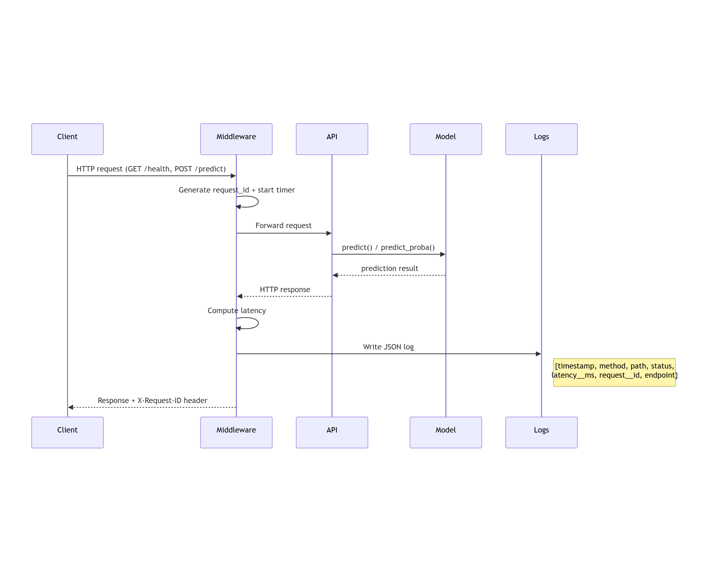

# M1-B2 — Squelette repo (Pyrenex Crédit scoring API)

> **Repo template GitHub.** Clique sur **« Use this template »** en haut à
> droite de cette page → **Create a new repository** → nomme-le
> `M1-B2-scoring-api-<prénom>` sur **ton** compte GitHub personnel.
> C'est ce nouveau repo que tu cloneras pour travailler.

---
##  Schéma Mermaid



##  Démarrage 

Sans Docker :

```bash
# 0. Clone ton repo perso fraîchement créé
git clone git@github.com:<ton-user>/M1-B2-scoring-api-<prenom>.git
cd M1-B2-scoring-api-<prenom>

# 1. Environnement virtuel
python -m venv .venv && source .venv/bin/activate     # Linux/macOS
# .venv\Scripts\activate                              # Windows

# 2. Dépendances
pip install -r requirements.txt

# 3. Vérification (avec ton modèle M1-B1 dans models/)
uvicorn app.main:app --reload                          # → /health doit répondre 200
```

Ensuite (autre terminal) :

```bash
curl http://localhost:8000/health
curl http://localhost:8000/info
pytest -v                                              # → 1 test exemple passe
```


Docker:

# Build
docker build -t pyrenex-risk-api:v0.1.0 .

# Run
docker run -d -p 8000:8000 --name pyrenex-api pyrenex-risk-api:v0.1.0

# Vérif
docker ps                                       # → STATUS doit contenir (healthy)
curl http://localhost:8000/health               # → {"status": "ok"}
curl http://localhost:8000/info                 # → JSON métadonnées

# Stop
docker stop pyrenex-api && docker rm pyrenex-api

---

## Exemples

# GET /health
curl http://localhost:8000/health
Response: 
{"status":"ok"}


# GET /info
curl http://localhost:8000/info
Response:
{
  "api_version": "0.1.0",
  "model_name": "pyrenex_risk_v2",
  "model_version": "v2.0.0",
  "created_at": "2026-06-28T01:36:16.217249+00:00",
  "sklearn_version": "1.8.0",
  "dataset_sha256": "d2da093bee40024b196e73a0d2d763193782f947e3d60552a3d7bbad0bd944e3",
  "metrics_holdout": {
    "f1_macro": 0.6123,
    "roc_auc": 0.7442
  }
}

# GET /info
curl http://localhost:8000/info
Response:


# POST /predict
curl -X POST http://localhost:8000/predict \
  -H "Content-Type: application/json" \
  -d '{
  "loan_amnt": 500,
  "term": "string",
  "int_rate": 50,
  "installment": 0,
  "grade": "E",
  "emp_length": "string",
  "home_ownership": "string",
  "annual_inc": 10000000,
  "verification_status": "string",
  "purpose": "string",
  "dti": 100,
  "delinq_2yrs": 0,
  "fico_range_low": 300,
  "revol_util": 150
}
Response:
{
  "prediction": 1,
  "probability": 0.8075817529816266,
  "model_version": "v2.0.0",
  "request_id": "ff2e28d6-27a5-4d8a-8d05-bf0aea990274"
}


## Testing

# Contract test
pytest tests/test_model_contract.py -v

# API tests
pytest tests/test_api.py -v

# All tests
pytest -v


## Logging

All requests are logged as structured JSON to logs/api.log


## Versioning

API: MAJOR (v1.0.0 → v2.0.0) / MINOR (v2.0.0 → v2.1.0) / PATCH (v2.0.0 → v2.0.1)
Model: vMAJOR.MINOR.PATCH (tag du modèle (M1-B1, repo de scoring))
Git tags: v<API_VERSION>-api (API est validée)

## Structure du repo

```
M1-B2-scoring-api-<prenom>/
├── app/
│   ├── __init__.py
│   ├── main.py                  # FastAPI app + lifespan + routes
│   ├── schemas.py               # Pydantic schemas (LoanApplication, Prediction)
│   └── middleware.py            # LoggingMiddleware Loguru
├── tests/
│   ├── __init__.py
│   ├── conftest.py              # fixtures pytest (client + valid_payload)
│   ├── test_model_contract.py   # test 0 — valide le .joblib avant l'API
│   └── test_api.py              # tests routes /health, /info, /predict
├── models/                      # ton .joblib + .json depuis M1-B1
│   └── .gitkeep
├── logs/                        # logs rotatifs (gitignored)
│   └── .gitkeep
├── ressources/                  # 📚 mini-cours d'appui (lecture juste-à-temps)
│   ├── 01_FastAPI_Pydantic_ml_essentiel.md
│   ├── 02_Dockerfile_Python_essentiel.md
│   ├── 03_Pytest_TestClient_essentiel.md
│   ├── 04_Loguru_middleware_essentiel.md
│   ├── 05_Versionning_modele_essentiel.md
│   ├── liens_officiels.md
│   └── README.md                
├── Dockerfile                   
├── .dockerignore
├── .gitignore
├── requirements.txt
├── LOGGING.md
└── README.md (ce fichier)
```

---

## Bloqué·e ?

1. **Swagger** : ouvre `http://localhost:8000/docs` — souvent le plus
   rapide pour débugger.
2. **Logs** : lis `logs/api.log` pour repérer les exceptions.
3. **Tests local d'abord, Docker ensuite** : si `pytest` est rouge en
   local, inutile de tester Docker — fix le code d'abord.
4. **`docker logs <container>`** : voir ce que le container raconte au
   démarrage.
5. Mini-cours dédiés dans [`./ressources/`](./ressources/).
